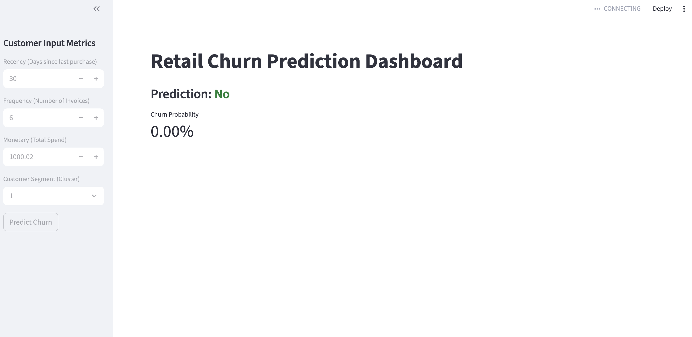
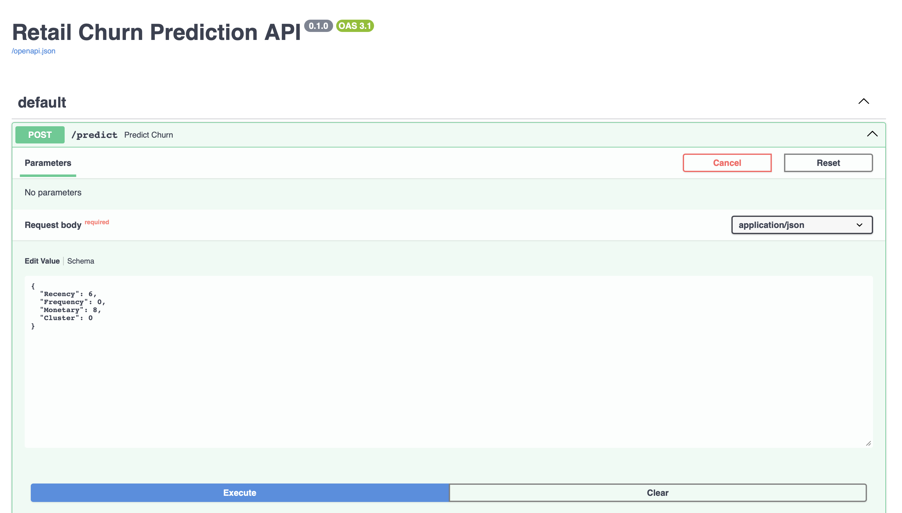

#  Retail Intelligence & Churn MLOps Pipeline

[](https://github.com/ernestekaitoo/End-to-end-retail-projects/actions/workflows/main.yml)

An end-to-end MLOps system that processes **1.06M+ retail transactions** to predict customer churn and forecast sales. This project demonstrates a production-grade architecture using microservices and automated CI/CD.

##  System Architecture
The system is built using a **Decoupled Microservices Architecture** orchestrated with Docker Compose:

* **The Brain (Backend):** A FastAPI service serving a Random Forest classifier and a Prophet forecasting engine.
* **The Face (Frontend):** An interactive Streamlit dashboard for real-time customer risk assessment.
* **The Pipeline:** Automated data cleaning, RFM analysis, and K-Means clustering.

## 🖥️ Project Previews

### User Interface (Streamlit)
The dashboard allows stakeholders to input customer metrics and receive real-time churn probabilities.


### API Documentation (FastAPI/Swagger)
The model is served via a REST API, featuring interactive Swagger documentation for seamless integration.



```
├── .github/
│   └── workflows/
│       └── mlops-pipeline.yml    # CI/CD: Automated builds & linting
├── data/                         # 1.06M+ records (ignored via .gitignore)
├── models/                       # Serialized RF & Scaler artifacts
├── src/                          # Modular engine (Train/Forecast)
│   ├── __init__.py
│   ├── train.py
│   ├── forecast.py
│   └── predict.py
├── app.py                        # Service 1: FastAPI "The Brain"
├── dashboard.py                  # Service 2: Streamlit "The Face"
├── Dockerfile                    # API container blueprint
├── Dockerfile.dashboard          # Dashboard container blueprint
├── docker-compose.yml            # Multi-service orchestrator
├── Makefile                      # One-word automation (make up)
├── requirements.txt              # Pinned production dependencies
└── README.md                     # Documentation & Architecture
```

##  Tech Stack
* **Data:** Pandas, NumPy (Processing 1.06M rows)
* **ML/AI:** Scikit-Learn (Random Forest), Prophet (Forecasting)
* **API/UI:** FastAPI, Streamlit
* **DevOps:** Docker, Docker Compose, GitHub Actions (CI/CD)

##  How to Run
Ensure you have Docker Desktop running, then use the provided Makefile:

```bash
# Build and launch the entire stack
make up

```

Access the **Dashboard** at `http://localhost:8501` and the **API Docs** at `http://localhost:8000/docs`.

##  Key Achievements

* **Orchestrated Microservices:** Decoupled model inference from the UI for improved scalability.
* **Automated CI/CD:** Integrated GitHub Actions to automate linting and Docker builds.
* **Scale:** Successfully handled a global retail dataset with over 1 million records.


